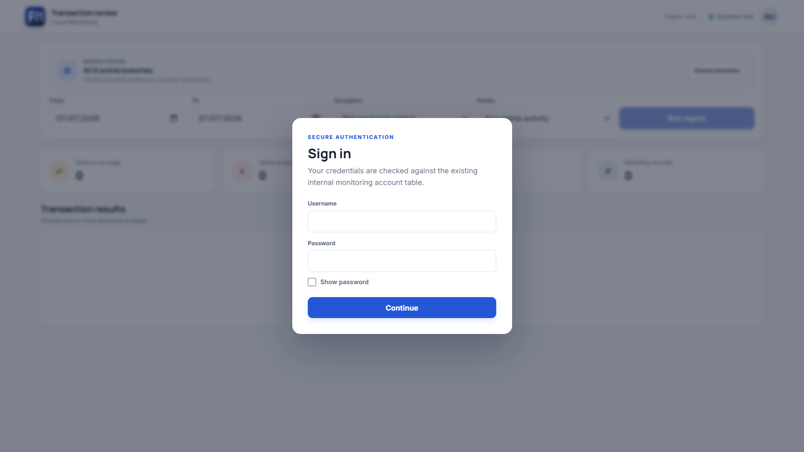
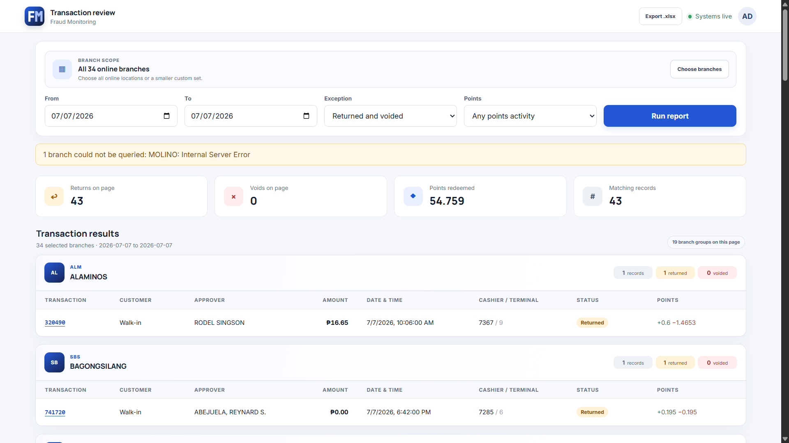
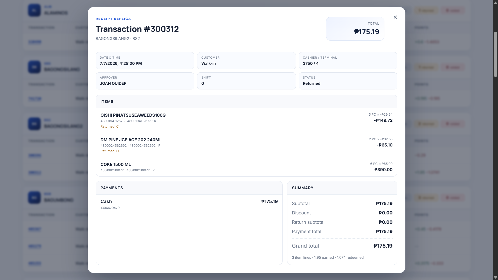

# Fraud Monitoring

A stateless, read-only reporting layer for branch POS transactions. The monorepo contains a NestJS API and Next.js dashboard; it does not own or provision a database.

## Screenshots

### Secure login



### Transaction review dashboard



### Receipt replica modal



## Architecture

```text
Browser (Next.js)
  |-- same-origin /api proxy --------------------> NestJS API
  |                                                  |-- Datacenter branch directory
  |                                                  |-- Existing monitoring_auth MySQL table
  |                                                  |-- Selected branch MSSQL POS database
  |                                                  `-- Selected branch MySQL srspos.audit_trail
  |-- transaction review dashboard
  |-- one report request per selected branch
  |-- receipt replica modal per transaction
  `-- filtered XLSX export
```

The public branch list is cached for two minutes by default after credentials have been removed. Branches are labeled with `branchlocation`, sorted alphabetically, and locations ending in `_FC` are excluded.

The frontend sends one report request per selected branch concurrently, merges successful responses, and shows failed branches as warnings. Each branch report request creates one dynamic TypeORM `DataSource`, executes fixed parameterized SQL, and destroys it in `finally`. There is no boot-time branch database connection.

The receipt modal loads only when a transaction number is clicked. It reads the selected branch's `FinishedTransaction`, `FinishedSales`, `FinishedPayments`, `Products`, and `POS_Products` tables, then enriches the approver from the same branch IP's MySQL `srspos.audit_trail` table where `description` contains `oic approval`.

## Repository

```text
backend/                     NestJS API
frontend/                    Next.js App Router dashboard
docker-compose.dev.yml       Development services
.github/workflows/ci.yml     GitHub Actions CI
```

There must be one `.git` directory at this root and none below it.

## Local setup

Requirements: Node.js 20.11+ (22 recommended), npm 10+, and network access to the existing datacenter, auth, selected MSSQL branch services, and branch audit MySQL services.

```powershell
Copy-Item .env.example .env
npm install
npm run start:dev --workspace backend
npm run dev --workspace frontend
```

Open locally:

- Dashboard: `http://localhost:7071`
- Backend health: `http://localhost:6060/api/health`
- Swagger: `http://localhost:6060/docs`

When running on a LAN server, replace `localhost` with the server IP, for example:

- Dashboard: `http://192.168.0.52:7071`
- Backend health: `http://192.168.0.52:6060/api/health`
- Swagger: `http://192.168.0.52:6060/docs`

The local `.env` contains service endpoints, application secrets, branch audit MySQL credentials, and behavior settings. It is ignored by Git and Docker build contexts. MSSQL report credentials still come from the datacenter branch directory per selected branch.

Approver lookup for receipt/report rows uses these branch audit MySQL variables:

```env
BRANCH_AUDIT_MYSQL_PORT=3306
BRANCH_AUDIT_MYSQL_USER=root
BRANCH_AUDIT_MYSQL_PASSWORD=your-local-secret
BRANCH_AUDIT_MYSQL_DATABASE=srspos
BRANCH_AUDIT_MYSQL_CONNECT_TIMEOUT_MS=30000
BRANCH_AUDIT_MYSQL_CONNECTION_LIMIT=2
```

`FRONTEND_ORIGINS` is a comma-separated CORS allowlist. The browser uses the same-origin `/api` path, and Next.js proxies it server-side to `BACKEND_API_URL` (`http://127.0.0.1:6060` for separate local npm processes). This allows remote users to access the complete application through the forwarded frontend port `7071` without exposing backend port `6060`. For Docker, Compose targets the backend service as `http://backend:6060`.

The Next.js proxy timeout is 31 minutes so it exceeds the backend's maximum 10-minute MSSQL connection wait plus 20-minute query timeout.

## Docker development

```powershell
docker compose -f docker-compose.dev.yml up --build
```

The compose file intentionally contains only `backend` and `frontend`. It is for development, not production.

## API

- `POST /api/auth/login` — validates against the existing `monitoring_auth` MySQL table and issues an application JWT.
- `GET /api/auth/me` — validates the current application JWT.
- `GET /api/branches` — sanitized branches including offline records.
- `GET /api/reports/transactions` — explicitly selected branches, date range, filters, and pagination.
- `GET /api/reports/transactions/receipt` — receipt replica for one transaction and branch.
- `GET /api/reports/transactions/export` — the same filters as XLSX, capped at 50,000 rows.

Report query parameters:

```text
branchIds, from, to, page, pageSize, exception?, returned?, voided?, points?
```

Receipt query parameters:

```text
branchId, transactionNo, terminalNo?
```

Dates are inclusive calendar dates. The report query applies `LogDate >= from AND LogDate < DATEADD(day, 1, to)` before exception filters to make existing date indexes useful. The displayed transaction date/time uses `FinishedTransaction.DateTime`. Date ranges are capped at 366 days and page size at 100.

The default `exception=returnedOrVoided` includes transactions with either a return or void flag. Branch connections allow 10 minutes to connect and report queries allow 20 minutes by default for slower local servers.

Pagination uses `ROW_NUMBER()` rather than `OFFSET/FETCH` for compatibility with older branch SQL Server versions.

## Security and operational behavior

- Every branch query is read-only and uses fixed SQL with driver-bound parameters.
- The backend sends `API_KEY` as `api-key` only to the branch directory. It is never exposed through `NEXT_PUBLIC_*` or browser requests.
- Guarded endpoints verify JWT signatures with `JWT_SECRET`, allow only HS256, and require a valid `exp` claim. Optional `JWT_ISSUER` and `JWT_AUDIENCE` values tighten claim validation when supplied.
- `/api/auth/me` returns the verified expiration timestamp; the frontend signs out at that exact time, removes its stored token, and restores the blocking login screen. It also revalidates the session every 60 seconds and when the window regains focus.
- Use least-privilege MSSQL and MySQL logins whose only required permission is `SELECT` on the needed objects.
- Errors returned to the browser never include hostnames, usernames, passwords, or driver details.
- Pino logs redact authorization, cookies, passwords, and branch credential field names.
- Transaction reports allow 120 requests per minute so the UI can fan out across the supported 100 selected branches; exports remain limited to 5 per minute.
- XLSX strings beginning with spreadsheet formula characters are neutralized.
- CORS is restricted to `FRONTEND_ORIGINS`; Helmet is enabled.
- Query audit events include branch ID, date range, external username, duration, and row count, but no credentials.

## Known schema assumptions

1. `CustomerName` uses `FinishedTransaction.Description` and falls back to `CustomerCode`. Confirm whether a dedicated customer master should replace this source.
2. Positive `FinishedSales.Points` with `PointsPosted = 1` is treated as earned; negative points are treated as redeemed. Confirm the loyalty ledger or transaction-type field before relying on this classification.
3. Receipt approver uses MySQL `srspos.audit_trail.name`, matched by `TransactionNo` and `description` containing `oic approval`. `UserID` is only a fallback when `name` is blank.

`DATACENTER_ACTIVE_VALUE` defaults to `0`, matching the supplied directory record where `isactive: 0` and `branchconnected: 1` represents an online branch.

The auth implementation remains behind `AuthProvider`. `LocalAuthProvider` performs a parameterized, read-only lookup against `monitoring_auth`, issues an HS256 JWT, and cryptographically verifies bearer tokens on every guarded request. The application does not create, migrate, or write authentication tables.

`branchIds` accepts a comma-separated list and is capped at 100 explicit selections. The web app intentionally sends a separate GET for every selected branch, for example `branchIds=29`, `branchIds=31`, and `branchIds=32`, so those branch queries can run concurrently. The backend retains comma-separated support for direct API clients. The branch MSSQL port defaults to `1433`, and `branchserverport` is honored if the directory returns it.

## Verification

```powershell
npm run lint
npm run typecheck
npm test
npm run build
```

Unit tests cover dynamic connection lifecycle, fixed report SQL/points rules, local-date formatting, and XLSX generation/formula safety. Integration tests should point to a separately managed sandbox instance; this repository must never migrate or seed it.

CI runs lint, type-check, test, and build. Deployment remains an explicit placeholder until the target environment is known.

## DBA performance note

The query narrows both header and sales scans by `LogDate` before evaluating `Return`/`Voided`. If real volume is still slow, collect actual execution plans and ask the DBA for covering indexes based on observed predicates and included columns. Do not make schema changes from this application.
